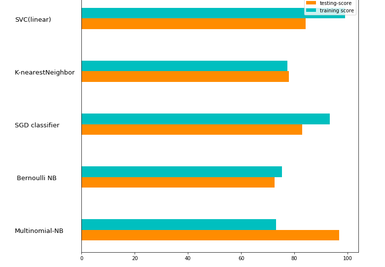
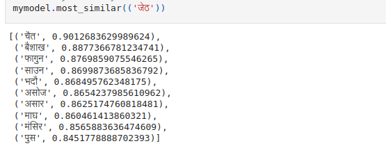
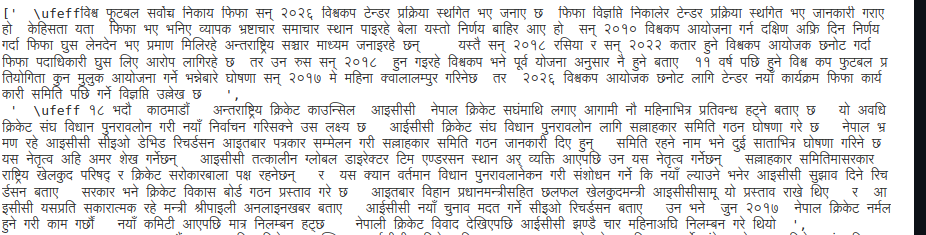

## Nepalese News Categorization
In this project, we scraped articles from different categories from online-khabar. Then, we analyzed the efficacy of different Machine learning classifiers.
For featurization, we use Tf-IDF Vectorization after stemming the nepalese words and removing stopwords.

## Experimentation with Word Vectors and Document vectors.

We used gensim to train a word2vec model on this news corpus data. In example below, the most similar words to "Jestha" are months as well.

We also used Doc2Vec model that can generate vector embeddings for the news document. We then visually inspect the most similar news to the given document.  

## Dependencies
1. pandas
2. codecs
3. numpy
4. pickle
5. sklearn
6. gensim
7. python 3+ to support unicode

## NOTES
goodNewsData.tar.gz contains csv file where each row contains a single Nepalese news article.
